# CompositeWorks
CompositeWorks is a simple set of two Lua scripts and a Python one that work in tandem in order to achieve a universal way to send and receive Composite data over HTTP in [Stormworks: Build and Rescue](https://store.steampowered.com/app/573090/Stormworks_Build_and_Rescue/).\
Pre-built Microcontrollers can be found at [Releases](https://github.com/jonasCCa/CompositeWorks/releases).
A pre-built sample vehicle can be found at the [Workshot page](https://steamcommunity.com/sharedfiles/filedetails/?id=3568139215).

### If you only care about setting it up, jump to [How To Set Up](#how-to-set-up).


## How Does It Work
Utilizing the telemetry functionality available to the Lua scripts within Stormworks Microcontrollers, the CompositeWorks scripts communicate with the HTTP Server hosted locally in order to send and receive information about a specific Composite set.

The Composite data is stored in a [dictionary](https://docs.python.org/3/tutorial/datastructures.html#dictionaries) that uses the IDs as keys and, as values, smaller dictionaries containing the number and boolean arrays.


### Endpoints
The HTTP Server for CompositeWorks contains two endpoints, `/getComposite` and `/postComposite`.\
The telemetry functions on Stormworks' Lua only contain functionality for GET endpoints, so while the latter is technically a GET as well (with the data present inthe URL itself, instead of the body), it's names as a POST for simplicity sake, since it's the one sending the data to be stored in the server.

Note that Stormworks' `httpReply` callback discards the Status Code, so the only reasons to implement those on endpoints would be for completness sake or for use outside of the game.


#### → `/getComposite`
Retrieves a Composite set from the HTTP Server, while specifying the ID on the arguments.

Example Request:
```
/getComposite?id=default
```
---
Example Response:
```
0,0,0,0,0,0,0,0,0,0,0,0,0,0,0,0,0,0,0,0,0,0,0,0,0,0,0,0,0,0,0,0,00000000000000000000000000000000

Status Code: 200
```
Where:
- Arguments:
    - `id` is the key used to find the Composite set;
- Response:
    - Reponse Body contains the two arrays in succession, with the number array being comma-separated and the boolean array as a 32 character binary-representing string;
        - The Body will always contain _some_ value. Invalid IDs will produce zeroed out values.
    - Possible Status Codes:
        - `200` for successful requests;
        - `404` for IDs that have yet to be stored;
        - `422` for invalid requests (missing any parameters).
        
&nbsp;
#### → `/postComposite`
Stores a Composite set on the HTTP Server, while specifying the ID and both the number and boolean arrays on the arguments.

Example Request:
___
```
/postComposite?id=default&n=0,0,0,0,0,0,0,0,0,0,0,0,0,0,0,0,0,0,0,0,0,0,0,0,0,0,0,0,0,0,0,0&b=0,0,0,0,0,0,0,0,0,0,0,0,0,0,0,0,0,0,0,0,0,0,0,0,0,0,0,0,0,0,0,0
```
Where:
- Arguments:
    - `id` is the key the sent Composite will be saved onto. Note that any existing data on the specifying ID **will be overwritten**;
    - `n` is the Number array, containing the 32 numbers in ascending order;
    - `b` is the Boolean array, containing the 32 bool values in ascending order, represented by 0s and 1s;
- Response:
    - Response Body contains the name of the Status Code for in-game parsing purposes, since no other data is needed as a response;
    - Possible Status Codes:
        - `200` for successful requests;
        - `422` for invalid requests (missing any parameters).
&nbsp;
---


### Differences between Single and Multiplayer
It's important to note the differences in behavior, depending on the Client-Server situation the player is in. Since the Lua scripts [run locally on every client](https://stormworks.fandom.com/wiki/Wiki/Guides/Lua/Exploring_the_Stormworks_Lua_API#Theory), one can't expect sending data from a client to the host's HTTP local server directly. While this could be done with yet another layer, that's outside the scope of this project. Fortunatly, what CompositeWorks needs in order to work should already be perfectly possible with just the Game's Host having the HTTP Server running, since the rest will be handled by the usual Multiplayer replication.

In a Single Player or Multiplayer Host scenario, the player's input changes values on the vehicle, which will in turn send those over Composite Inputs to the Sender Microcontroller that has a Lua script. This Lua script will then do an HTTP request over to the HTTP Server on the localhost, sending the Composite data over.\
Another vehicle present in the game has a Receiver Microcontroller that contains another Lua script, which will do an HTTP request over to the localhost HTTP Server. The server will send the Composite data for the requested ID and the information can then be used by the vehicle.

The main difference in a Multiplayer Guest scenario is that the players input will be passed from the Game Guest to the Game Server first and then the vehicles on the Game Server's end will do the HTTP requests successfully.\
Note that the Game Guest's vehicles **will still try to access the HTTP Server on localhost**, but either succeeding or failing will yield the same result, since what matters for CompositeWorks is the Composite input and outputs, which are properly synchronized.

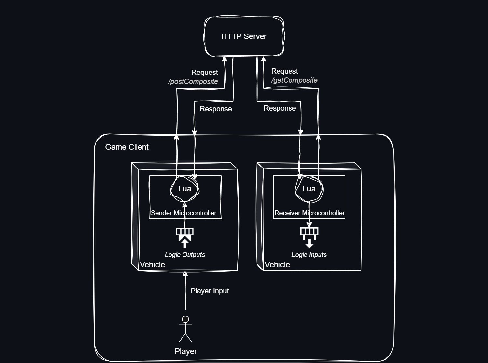


## How To Set Up
In order to set this functionality up you'll need at least two Microcontrollers (one that will send the data and another that will receive it) and the Flask server running.\
The steps below are required in order to get the minimal functionality.\
Alternatively, you can also use the pre-built Microcontrollers present in the [Releases](https://github.com/jonasCCa/CompositeWorks/releases) page and skip to [Step 3](#3-the-vehicles).


### 1. Composite Sender
The first step is to create the Sender Microcontroller.

__You'll need:__
- A __Composite Input__;
- A __Text Property__ called `ID`;
    - This will be used to identify the data and is required to retrieve it later.
- Any type of __Property Number__ called `port`;
    - This is the port your HTTP server is running on.
- Any type of __Property Number__ called `frequency`;
    - This determines the how many times a second the Lua script will hit the server;
    - __Be mindful__ of higher frequencies, you may stall your game's server;
    - The [released example](https://github.com/jonasCCa/CompositeWorks/releases) uses a Property Dropdown with pre-made frequencies for\
    ease of use.\
    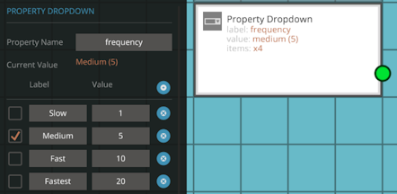
- A Lua Script node with the code present in [CompositeWorksSender.lua](CompositeWorksSender.lua) and the __Composite Input__ connected in.

\
__As an extra:__
- This Lua Script node will write the first Boolean Composite output to indicate whether a valid response was received.

\
__Note:__ writing the names _exactly like instructed_ is important!\
If you wish to change the property names, don't forget to change them in the script itself.

Below is an example of the minimal setup for the Sender Microcontroller.

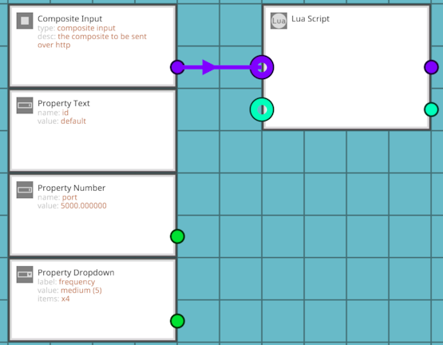


### 2. Composite Receiver
The second step is to create the Receiver Microcontroller.

__You'll need:__
- A __Composite Output__;
- All the same __Properties__ from [Step 1](#1-composite-sender);
- A Lua Script node with the code present in [CompositeWorksReceiver.lua](CompositeWorksReceiver.lua) and the __Composite Output__ connected from it.

Below is an example of the minimal setup for the Receiver Microcontroller.

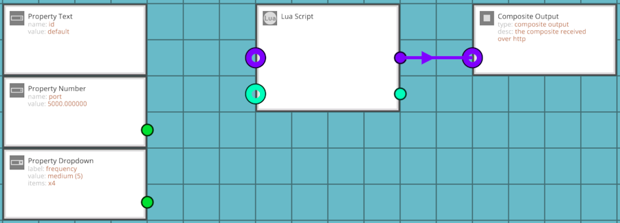


### 3. The Vehicles
Although you could have the data from and to the same vehicle, that would achieve nothing more than input delay and server load.\
This guide will use the Preset Tractor from the Preset vehicles as the _receiver_ and a simple custom vehicle that can be made in a couple of minutes as a _sender_ and focus on a one-to-one relationship with both, but a number of different combinations could be done.

__IMPORTANT:__ Note that both vehicles __must__ utilize the same ID on the Microcontroller configurations, since that is what will be used to communicate to the server what set of data will be sent or requested.


#### __3.1. Sender Vehicle__
This will be the vehicle responsible for sending the player's inputs to the server. The minimal setup for this is simply a something that has a Composite output, in this case a seat, and the Sender Microcontroller.\
Connect the _Seat data_ Composite output from the seat to the Sender Microcontroller's Composite input.

Vehicle Overview | Logic View
:-:|:-:
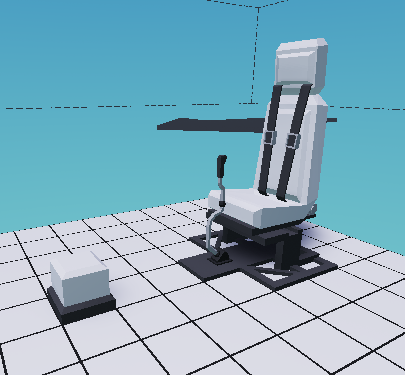 | 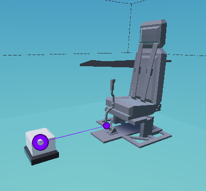

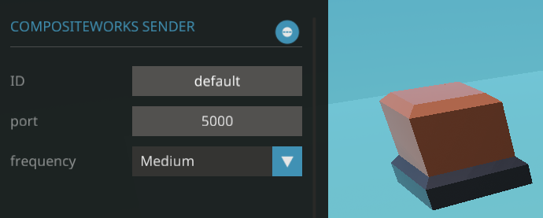


#### __3.2. Receiver Vehicle__
This will be the vehicle responsible for requesting to and receiving the player's inputs from the server. There isn't a strict minimal setup for this, since it's completely dependent on the use case, but this guide will, as stated on [Step 3](#3-the-vehicles), use the Preset Tractor and also the __Simple Seat Composite Decoder__ Microcontroller present in the [released example](https://github.com/jonasCCa/CompositeWorks/releases).

Vehicle Overview | Logic View
:-:|:-:
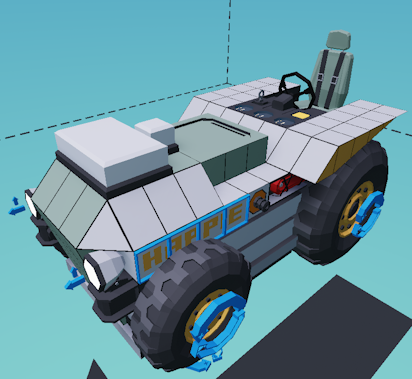 | 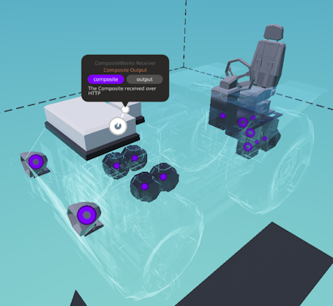

Carefully replace the outputs from the seat with the outputs from the Simple Seat Composite Decoder Microcontroller like the example below, for every output available on the Microcontroller.

Before | After
:-:|:-:
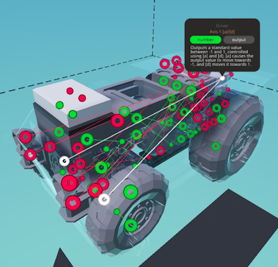 | 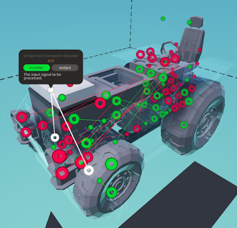


### 4. Server
Run a server with the [CompositeWorksServer.py](CompositeWorksServer.py) Python script.\
The simplest way to achieve that is through the following command:

```
flask --app .\CompositeWorksServer.py run
```

A detailed explanation of how to run and configure a server is out of the scope of this guide. For more information on that, refer to the official [Flask Documentation - Quickstart](https://flask.palletsprojects.com/en/stable/quickstart/).

After following these steps correctly, you should be able to test the two vehicles out.


